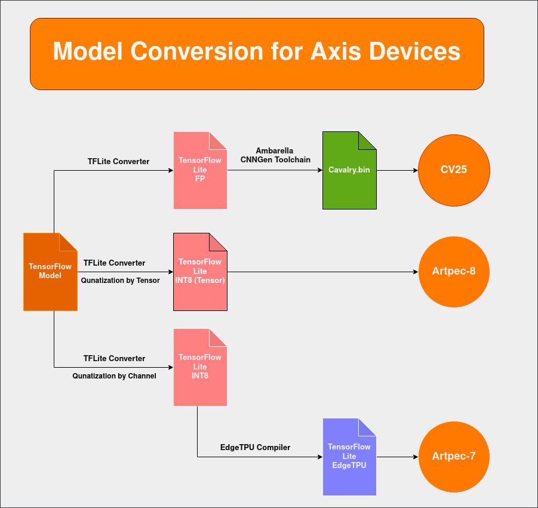

# DLPU model conversion

To convert your model for the DLPU in your device, you need to follow a specific procedure depending on the DLPU available. Here is a schematic that shows the different steps required for each DLPU:

## Artpec-7

To convert a model for the Artpec-7 DLPU, follow these steps:

1. Train a model using TensorFlow.
2. Quantize and export the saved model to TensorFlow Lite (tflite) using the TensorFlow Lite converter.
3. Compile the model using the EdgeTPU compiler.

Since the Artpec-7 DLPU is based on the EdgeTPU, you can refer to the [EdgeTPU guide](https://coral.ai/docs/edgetpu/compiler/) for instructions on converting your model. We recommend the [example](https://coral.ai/docs/edgetpu/retrain-detection/#download-and-configure-the-training-data) on retraining and converting SSD MobileNet for object detection. Note that this guide is only for training and converting the model to EdgeTPU. To deploy the model on the device, refer to one of the examples in the [develop-your-own-deep-learning-application](./develop-your-own-deep-learning-application) guide.

There are also many other open-source examples available on how to train, quantize, and export a model for the EdgeTPU. You can find these examples on the [Google Coral tutorials](https://colab.research.google.com/github/google-coral/tutorials/) page. Most of these tutorials use TensorFlow 1, which is no longer supported by Google Colab, but they can still be used as guidance and executed locally on your machine by installing TensorFlow 1.

Axis provides another example in the acap-native-examples GitHub repository called [tensorflow-to-larod](https://github.com/AxisCommunications/acap-native-sdk-examples/tree/main/tensorflow-to-larod) on how to train, quantize, and export an image classification model for Artpec-7.

## Artpec-8

To convert a model for the Artpec-8 DLPU, follow these steps:

1. Train a model using TensorFlow.
2. Quantize and export the saved model to tflite using the TensorFlow Lite converter.

Please note that the Artpec-8 DLPU is optimized for per-tensor quantization. You can achieve per-tensor quantization by using the TensorFlow Lite converter with TensorFlow 1.15 or with TensorFlow 2 and adding the conversion flag `_experimental_disable_per_channel = True`.

We recommend referring to the example on how to retrain and convert SSD MobileNet for object detection. You can find this example [here](https://coral.ai/docs/edgetpu/retrain-detection/#download-and-configure-the-training-data). Please note that you should only follow this guide to train, quantize, and export the model to tflite. **You should not convert it to EdgeTPU.** To deploy the model on the device, refer to one of the examples in the [develop-your-own-deep-learning-application](./develop-your-own-deep-learning-application) page.

Axis also provides an example on how to train, quantize, and export an image classification model for Artpec-8 in the [acap-native-examples GitHub repository](https://github.com/AxisCommunications/acap-native-sdk-examples). The example is called [tensorflow-to-larod-artpec8](https://github.com/AxisCommunications/acap-native-sdk-examples/tree/main/tensorflow-to-larod-artpec8).

Finally, we have a guide on how to convert Yolov5 to tflite, optimizing it for Artpec-8. You can find this guide in the [Axis-model-zoo](https://github.com/AxisCommunications/axis-model-zoo/blob/main/docs/yolov5-on-artpec8.md) repository.

## CV25

To convert a model for the CV25 DLPU, follow these steps:

1. Train a model using TensorFlow.
2. Export the saved model to TensorFlow Lite format using the TensorFlow Lite converter.
3. Compile the model using the Ambarella toolchain.

Converting a model for the CV25 DLPU is slightly more complex compared to other DLPUs. The toolchain for converting your model is not publicly available. To gain access to the toolchain, please contact [Ambarella](https://customer.ambarella.com/ng/) directly.

Once you have access to the toolchain, refer to their examples on how to convert a model. Axis also provides an example on how to convert a model for the CV25 DLPU in the acap-native-examples GitHub repository, [tensorflow-to-larod-cv25](https://github.com/AxisCommunications/acap-native-sdk-examples/tree/main/tensorflow-to-larod-cv25).

Differently from the other DLPUs, the CV25 DLPU requires the input to be in the RGB-planar format.

Continue reading about [General suggestions](./general-suggestions).
