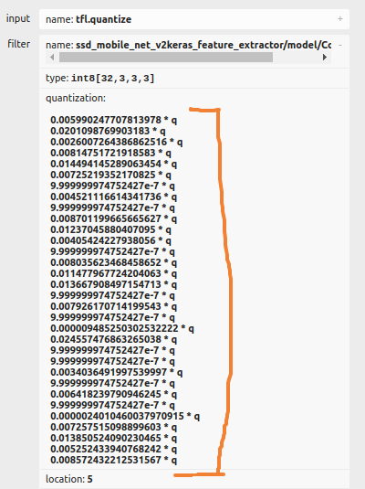
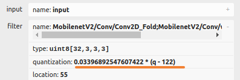
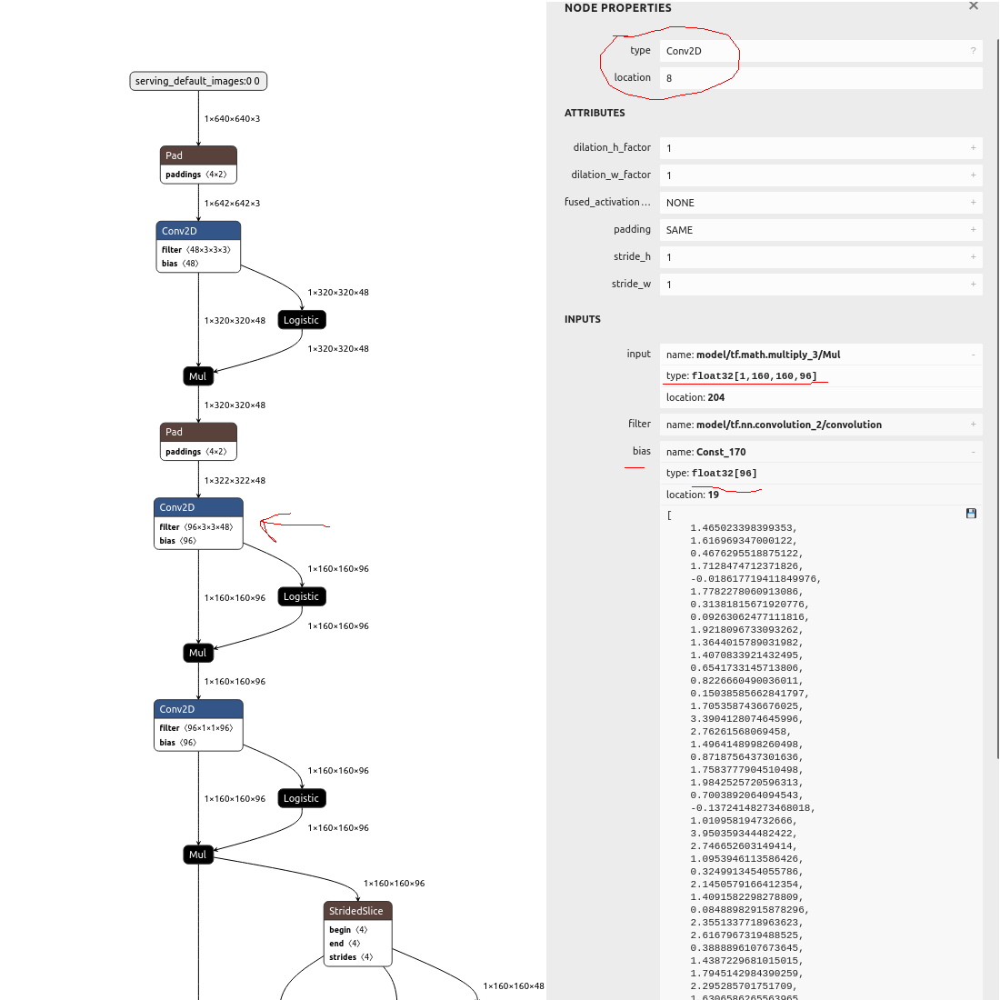

# Quantization

## What is quantization?

Quantization is the process of converting the weights of a model from floating-point format to integer format. This is necessary to run a model on a DLPU (Deep Learning Processing Unit), as DLPUs only supports integer operations. Quantization can be performed during or after training.

## Types of quantization

### Post-training quantization vs quantization aware training

There are two main types of quantization: post-training quantization and quantization aware training.

- **Post-training quantization** is the process of converting the weights of a model from float format to integer format after the training is completed. This process usually requires a subset of the training data to be used for calibration. Typically, 100 images are enough for calibration. [Learn more about post-training quantization](https://www.tensorflow.org/model_optimization/guide/quantization/post_training).

- **Quantization aware training** is the process of training a model with quantization in mind. This means that the model is trained to be more robust to quantization. Quantization aware training is more complex, but it often results in a better model. [Learn more about quantization aware training](https://www.tensorflow.org/model_optimization/guide/quantization/training).

### Per-tensor quantization vs per-channel quantization

There are also two methods of quantization: per-tensor quantization and per-channel quantization.

- **Per-tensor quantization** is the process of quantizing the weights of the model using the same scale for all the weights in the same layer. The quantization error given by this process is usually higher than per-channel quantization, it is however required for some DLPUs to function optimally.

- **Per-channel quantization** is the process of quantizing the weights of the model using a different scale for each channel in the same layer. This results in a more accurate quantization. This is also the default quantization method in TensorFlow 2.

## Quantization for each DLPU

Different DLPU models have different recommendations for quantization.

- For Artpec-7 both per-tensor and per-channel quantization are supported. However, per-channel quantization is recommended as it results in a more accurate quantization.

- For Artpec-8, it is recommended to use per-tensor quantization due to hardware limitations. Per-channel quantized models can still work on Artpec-8, but you may experience a significant performance drop in terms of speed and accuracy.

- For CV25, quantization is performed directly by the compiler, which will automatically optimize the quantization for the model. This means you don't need to quantize the model before converting it to the CV25 DLPU.

## Supported quantization by TensorFlow

There was a breaking change in TensorFlow between version 1 and version 2 regarding quantization. In TensorFlow 1, quantization was per-tensor by default, while in TensorFlow 2, quantization is per-channel by default. If you want to use per-tensor quantization with TensorFlow 2, it is still possible. For more information, refer to the [DLPU model conversion](./dlpu-model-conversion) page.

For more information about quantization in TensorFlow, check out the [TensorFlow optimization page](https://www.tensorflow.org/lite/performance/post_training_quantization).

## Verify quantization of your model

To ensure that your model is properly quantized, you can use Netron, a model viewer that allows you to inspect the quantization parameters of your model.

To verify the quantization of your model, follow these steps:

1. Open Netron at [netron.app](https://netron.app/).
2. Load your model into Netron.
3. Click on any convolutional layer in the model.
4. Navigate to the input and filter sections.

You will be able to see if your model is quantized by channel or by tensor.

- If you see multiple lines in the quantization parameters, your model is quantized by channel. This is not be optimized for ARTPEC-8, but will work better on other DLPUs.
- If you see a single line in the quantization parameters, your model is quantized by tensor. This is the optimized quantization method for ARTPEC-8.

Here are examples of the two types of quantization:

Quantized by channel             |  Quantized by tensor
:--------------------------------------:|:-------------------------:
  | 

## Full integer quantization

It is important to verify that each layer of your model is fully quantized, meaning that the entire layer is converted to integer format. This is known as full integer quantization and is the recommended approach for Axis devices.

Some quantization techniques may only quantize the kernel/filter of the convolution, while keeping the input, output, and bias in floating-point format. However, this approach is not suitable for Axis devices.

To ensure that your model has correct quantization, you can use Netron to inspect the quantization parameters.

Here is an example of a model with incorrect quantization, where only the filters of the convolution are quantized, while the rest remains in floating point:

For more information on how to convert your model for different DLPU, refer to the [DLPU model conversion](./dlpu-model-conversion) page.
