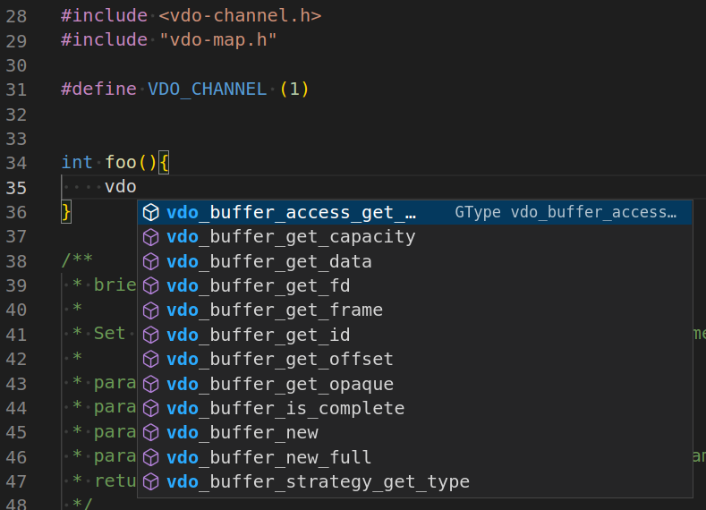

# Setting up Visual Studio Code

Visual Studio Code provides access to containerized development tools, without the need for you to install them natively on your development computer.

## Development container

To start developing ACAP applications using Visual Studio Code:

1. Install the **[Dev Containers](https://marketplace.visualstudio.com/items?itemName=ms-vscode-remote.remote-containers)** extension available in the **Extensions Marketplace** in **Visual Studio Code**.
2. Create a development container
   - Option 1:
       If your application does not need  external libraries, you can choose the `acap-native-sdk` image as your development container:

       ```sh
          # armv7hf
          docker pull acap-native-sdk:latest-armv7hf-ubuntu22.04
          docker tag axisecp/acap-native-sdk:latest-armv7hf-ubuntu22.04 my-dev-container
          # aarch64
          docker pull acap-native-sdk:latest-aarch64-ubuntu22.04
          docker tag axisecp/acap-native-sdk:latest-aarch64-ubuntu22.04 my-dev-container
       ```

   - Option 2:
       Otherwise, you will need to create your own Docker image building the libraries that you need.
       See as an example [using-opencv](https://github.com/AxisCommunications/acap-native-sdk-examples/blob/main/using-opencv/Dockerfile) which builds OpenCV libraries using the ACAP Native SDK. The application container image will be used as a development container and have access to OpenCV symbols.     Let's build the Docker image with the following command, depending on your architecture:

        ```sh
        docker build --build-arg ARCH=armv7hf -t my-dev-container .
        docker build --build-arg ARCH=aarch64 -t my-dev-container .
        ```

3. Create a subfolder called `.devcontainer` in the top directory of the source code project you are working on.
In `.devcontainer`, create a `devcontainer.json` with the following content:

   ```json
   {
      "name": "My acap-native-sdk container",
      "image": "my-dev-container"
   }
   ```

4. In VS Code, press `F1` and type in `Dev Containers: Open Folder in Container`. Choose the directory where the `.devcontainer` directory is placed.

The application restarts and is now attached to a container with the SDK and your code. This way, you can interactively edit your source code just as if the tools had been installed natively, including using all the debugging and support features in Visual Studio Code.

You can install different versions of the SDK in separate containers. When you open your source code folder, Visual Studio Code identifies the SDK version defined in the `devcontainer.json`.

The ACAP Native SDK container includes all the SDK tools, Git, and some other useful things. But you can create your own Dev Container Dockerfile or add more tools to the `devcontainer.json` configuration. See [Microsoft's tutorials on how to use Development Containers](https://code.visualstudio.com/docs/remote/containers) for more information on what this way of working can offer.

## Code completion of Axis APIs

To access the header files of the Axis APIs inside the Development container, the following architecture independent path should be added to the VS Code extension configuration of your choice:

```text
${SDKTARGETSYSROOT}/usr/include/
```

### Microsoft C/C++ extension

To enhance your development experience in Visual Studio Code, you can install the Microsoft [C/C++ extension](https://marketplace.visualstudio.com/items?itemName=ms-vscode.cpptools). This extension provides various features that can assist you with code editing and navigation.

To install and setup the extension, follow these steps:

1. Install the [C/C++ extension](https://marketplace.visualstudio.com/items?itemName=ms-vscode.cpptools)  available in the **Extensions Marketplace** in **Visual Studio Code**.
2. Create a subfolder called `.vscode` in the top directory of the source code project you are working on.
In `.vscode`, create a `c_cpp_properties.json` with the following content:

   ```json
   {
       "configurations": [
           {
               "name": "Linux",
               "includePath": [
                   "${workspaceFolder}/**",
                   "${SDKTARGETSYSROOT}/**",
               ]
           }
       ],
       "version": 4
   }
   ```

Once the installation is complete, you can benefit from features such as IntelliSense and code browsing.
You can now, for example, get suggestions about Axis libraries as you type or hover over a symbol:

<!-- markdownlint-disable MD033 -->


For detailed information on how to use the C/C++ extension and its various features, refer to the extension's documentation available in the [Visual Studio Code Marketplace](https://marketplace.visualstudio.com/items?itemName=ms-vscode.cpptools).
