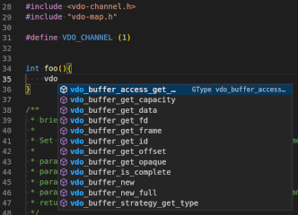
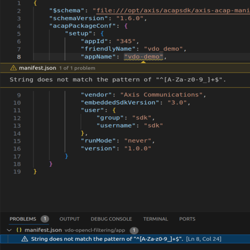

# Setting up Visual Studio Code

[Visual Studio Code](https://code.visualstudio.com/) is a powerful and versatile editor that supports a wide range of programming languages and platforms. It's highly customizable, allowing you to adjust its appearance and functionality to suit your specific needs. Moreover, it has a [rich ecosystem of extensions](https://marketplace.visualstudio.com/VSCode), which can further enhance your productivity. These extensions can provide additional features like code linting, debugging, version control, and even AI-assisted coding.

## Set up for ACAP Native SDK

One of the key features of Visual Studio Code is [Dev Containers](https://code.visualstudio.com/docs/devcontainers/containers), which enable the use of a [Docker](https://www.docker.com/) container as a full-featured development environment. The container houses everything required to build your application, encompassing the code, runtime, system tools, libraries, and settings.

The benefit of this approach is that you don't need to install these tools directly on your development computer. This not only saves you time and effort but also helps to avoid potential conflicts between different tools or versions. It ensures that your development environment is consistent and reproducible, which is particularly useful when you're working on a team project.

1. Open Visual Studio Code and install the **[Dev Containers](https://marketplace.visualstudio.com/items?itemName=ms-vscode-remote.remote-containers)** extension.
2. Create a subfolder called `.devcontainer` in the top directory of the source code project you're working on.
3. In `.devcontainer`, create `devcontainer.json` with the following content:

    ```json
    {
        "name": "ACAP Native (aarch64)",
        "build": {
            "dockerfile": "Dockerfile",
            "args": {
                "ARCH": "aarch64"
            }
        },
        "customizations": {
            "vscode": {
                "extensions": [
                    "ms-vscode.cpptools-extension-pack",
                    "ms-vscode.makefile-tools",
                    "ms-azuretools.vscode-docker"
                ]
            }
        }
    }
    ```

    You might need to replace `aarch64` with `armv7hf` as it depends on the device your application targets. Refer to [Axis devices & compatibility](../axis-devices-and-compatibility/) for a list of supported architectures.
4. In `.devcontainer`, create `Dockerfile` with the following content:

    ```dockerfile
    ARG ARCH
    ARG VERSION=latest
    ARG UBUNTU_VERSION=22.04
    ARG REPO=axisecp
    ARG SDK=acap-native-sdk

    FROM ${REPO}/${SDK}:${VERSION}-${ARCH}-ubuntu${UBUNTU_VERSION}

    RUN apt-get update
    RUN apt install cppcheck -y
    ```

    The ACAP Native SDK image includes SDK tools, Git, and some other useful things. You can add any other tools you want in the container to the `Dockerfile`. Use the `RUN` command, like `cppcheck` above. This also applies to external libraries that your application depends on. See [using-opencv](https://github.com/AxisCommunications/acap-native-sdk-examples/blob/main/using-opencv/Dockerfile) for an example on how to depend on [OpenCV](https://opencv.org/).

5. Create a new subfolder called `.vscode` in the top directory of the source code project you're working on.
6. In `.vscode`, create `c_cpp_properties.json` file with the following content:

    ```json
    {
        "configurations": [
            {
                "name": "Linux",
                "includePath": [
                    "${workspaceFolder}/**",
                    "${SDKTARGETSYSROOT}/**"
                ]
            }
        ],
        "version": 4
    }
    ```

7. In Visual Studio Code, click **View** > **Command Palette...** and type `Dev Containers: Reopen in Container`. This restarts Visual Studio Code, builds the container if it doesn't exist, and then opens the source code in the container. This might take some time the first time you do it.

After the container is built, you can use features like IntelliSense and code browsing. For example, you can get suggestions about Axis libraries as you type or hover over a symbol:



For detailed information on how to use the C/C++ extension and its features, look at the extension's documentation:

- [C/C++ Extension Pack](https://marketplace.visualstudio.com/items?itemName=ms-vscode.cpptools-extension-pack) - Popular extensions for C++ development in Visual Studio Code.
- [Makefile Tools](https://marketplace.visualstudio.com/items?itemName=ms-vscode.makefile-tools) - Provides makefile support in VS Code: C/C++ IntelliSense, build, debug/run.
- [Docker](https://marketplace.visualstudio.com/items?itemName=ms-azuretools.vscode-docker) - Makes it easy to create, manage, and debug containerized applications.

### Manifest validation

With devcontainer support, you can validate the ACAP application manifest file in real time. This new feature ensures that the manifest follows the correct schema format, which improves development efficiency and reliability.

1. In `.vscode`, create `settings.json` file with the following content:

    ```json
    {
        "json.schemas":
        [
            {
                "fileMatch": ["**/manifest.json*"],
                "url": "/opt/axis/acapsdk/axis-acap-manifest-tools/schema/schemas/v1/*.json"
            }
        ]
    }
    ```

2. Update `manifest.json` file of an ACAP application with the field `$schema`. Note that it must match the version in `schemaVersion`:

    ```json
    {
        "$schema": "file:///opt/axis/acapsdk/axis-acap-manifest-tools/schema/schemas/v1/application-manifest-schema-v1.6.0.json",

        "schemaVersion": "1.6.0"
    }
    ```

3. Visual Studio Code will highlight errors in the manifest file. Have a look at the following examples to see how it works:

    - Introduce a hyphen in the field `appName`. The error will be highlighted and displayed as follows in the _PROBLEMS_ section of VS Code:

    

    - Change the data type of any field (i.e. enter an integer value like 346 in the field `appId` without putting it into double quotes) and the error will be highlighted and displayed in the _PROBLEMS_ section of VS Code.
