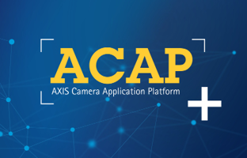

# ACAP documentation

{: .float-right .pt-3 .pl-2 .pb-10}

Welcome to the AXIS Camera Application Platform (ACAP) documentation. This
documentation primarily focuses on the latest released version. For
more information of released versions of ACAP, see [Version history](./docs/version-history).

For information about the ACAP offering and the developer environment, start out
with the [Introduction](docs/introduction).

To start developing ACAP applications, continue to [Get
started](docs/get-started).
