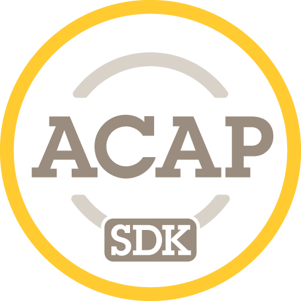

<h1 class="title-attention">Disclaimer: Beta stage</h1>
This documentation is in beta until ACAP 4 release date 27 Sept

# AXIS ACAP 4 SDK Documentation

Welcome to the ACAP 4 SDK documentation.

For information of ACAP and the two new SDKs, start out with the [Introduction](docs/introduction.html).

To start development of ACAP applications, continue to [Get started](docs/get-started.html).
{: .pb-8 }

