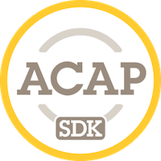

# ACAP SDK Documentation

{: .float-right }

Welcome to the AXIS Camera Application Platform (ACAP) SDK documentation. This documentation primarily focuses on the latest version of ACAP, version 4. For information in previous versions of ACAP, see [ACAP SDK version 3](./docs/acap-sdk-version-3/).

For information about ACAP and the two new SDKs, start out with the [Introduction](docs/introduction).

To start developing ACAP applications, continue to [Get started](docs/get-started).

Examples applications are available in
[ACAP Native SDK Examples](https://github.com/AxisCommunications/acap-native-sdk-examples)
and
[ACAP Computer Vision SDK Examples](https://github.com/AxisCommunications/acap-computer-vision-sdk-examples)
{: .pb-8 }
